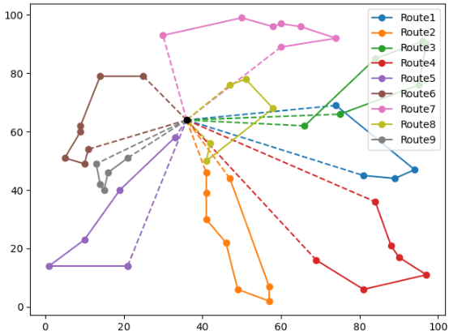

# VRP
This repository holds a example solution to the well-known Vehicle Routing problem [1]. Given a number of trucks starting at a common station and stops defined by (x,y)-coordinates, the optimal routes that minimise the driven distance have to be determined. Each truck has a load capacity, and each stop has a certain weight which needs to be picked up. The trucks may not exceed their load capacity and need to return to the initial station.

A possible solution is found through genetic algorithms. Of course, other methods would also be applicable. A dataclass called chromosome, which contains two equal length arrays and a fitness value, represents the solution. The first array contains all the stops which means that it is in order-based representation. The second array is in integer representation and contains integers ranging from 0 to 8 depicting the different vehicles. Together they represent a solution in such that each vehicle visits all the stops where its own number is at the same index as the stop. The order of the visits is in the order of the appearance of the stops in the stops array. Hence, this technique is a valid approach to represent a solution. The fitness value is later determined by applying the fitness function to a chromosome. At each generation, the chromosomes are modified with crossovers, mutations and a selection process. To address vehicle capacities, a penalty cost in the fitness function is used. For each vehicle, it is checked whether it is overweight or not. If it is, a penalty cost of $(W_{vehicle}-W_{max}) * 1000$ is applied, leading to the fact that overweight solutions are penalised drastically.

## Installation

Use a Python version > 3.7. There is a dependency of matplotlib, which can be installed with `pip install -r requirements.txt`. To run the script, use `python vrp.py`. If a run takes too long, consider reducing the `NO_GENERATIONS` or the problem size in general. The output is the runtime, the route and weight of each truck and a plot visualising the solution.

***

[1] https://en.wikipedia.org/wiki/Vehicle_routing_problem

